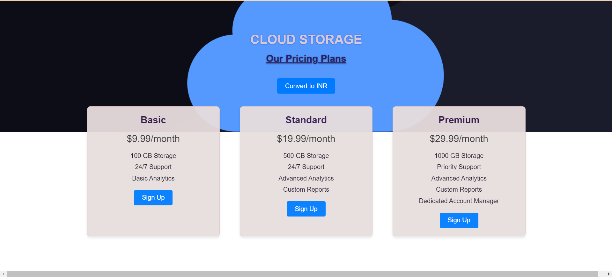

# Pricing Page
## Dive into the project
)<em>(Tap on 🔗 icon to view the project)</em>

## Cloud Storage Pricing Page with Currency Conversion (https://github.com/krishitdas/Pricing-Page)

This repository contains the code for a responsive and interactive pricing page for a cloud storage service.

**Features:**

* Clean and professional design with a background image (replace with your own!).
* Three pricing plans with clear descriptions and features.
* Smooth scroll to the pricing section on page load.
* Fade-in animation for the pricing plans when scrolled into view.
* Interactive currency conversion between USD and INR (replace the example rate with a mechanism to fetch the live rate).

**Technologies:**

* HTML: Provides the basic structure of the page.
* CSS: Styles the page elements for layout, visual design, and hover effects.
* JavaScript: Adds interactivity for smooth scrolling, pricing plan animation, and currency conversion.

**Getting Started:**

1. Clone the repository to your local machine.
2. Replace the placeholder background image URL in the CSS (`header { background-image: url('cloud.png'); }`).
3. Consider implementing a mechanism to fetch the live currency exchange rate in the JavaScript code.
4. You can further customize the styles and content to match your brand.

**Feel free to explore the code, make changes, and deploy your own cloud storage pricing page!**
